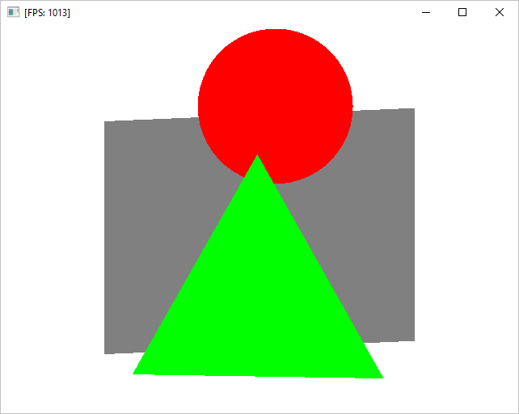

# Лабы по OpenGL

## Установка Clang

Код будем писать на C++ под виндой, а значит нужен компилятор. VS и GCC у меня отказываются работать, поэтому возьмем Clang. Качаем его [здесь](http://releases.llvm.org/download.html) (Pre-Built Binaries -> Windows (64-bit)) и устанавливаем.

**ВО ВРЕМЯ УСТАНОВКИ ВЫБИРАЕМ ПУНКТ `Add LLVM to the system PATH for all users`**

## Проекты

Проекты лежат в соответствующих папках, в `README.md` можно почитать поподробнее.

На гитхабе на вкладке [релизы](https://github.com/catinwarmhands/opengl_practice/releases) можно скачать уже скомпилированные проекты и поиграть.

* 2d



* maze


## Структура проектов

* В `src` содержатся все исходники, включая `main.cpp`
* В `libs` лежат нужные библиотеки
* В корне лежит `build.bat` который собирает 64 и 32 битные версии программы и линкует их с статическими библиотеками и кладет результат в папку `bin`. Всё это с помощью clang++.
* Файл `build_release.bat` собирает 64 и 32 битные экзешники с флагом `-Os` и копирует все вместе с ресурсами в папку `release\`
* В корне лежит `cleanup.bat`, который удаляет папку `bin` и `release`


## Компиляция проекта и запуск

### Из консоли:

После `build` можно указать какую версию надо собрать: 32 или 64 битную (если не указано - собирается обе)

Собрать 64 битную версию и запустить её:
```
build 64 && bin\game64
```

### Вручную:
* Двойной клик по `build.bat`
* Двойной клик по `bin\game64.exe`
