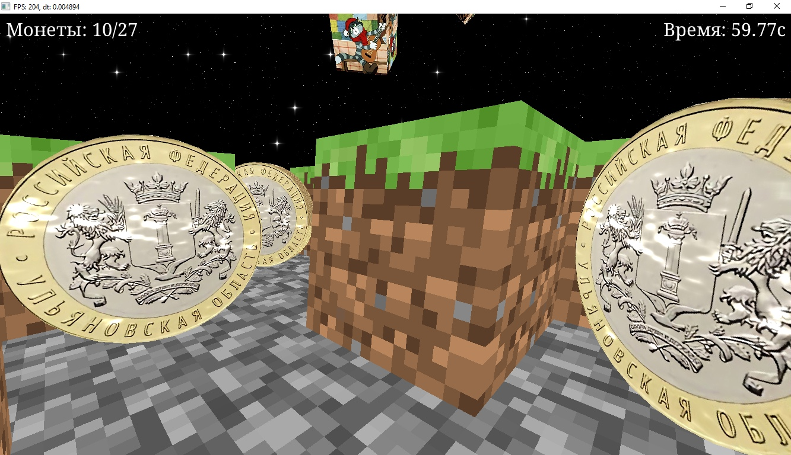

# Maze

Игра, в которой игрок попадает в волшебный и захватывающий мир майнкрафта в космосе. А конкретнее - в летящий сквозь межзвездные пространства лабиринт, по которому раскиданы десятирублевые монеты. Чем быстрее игрок перестанет глазеть на загадочный круговорот матроскиных и соберет все монеты, тем быстрее он поставит новый рекорд по времени.

## Управление

* `WASD` перемещение
* `Перемещение мыши` камера
* `Колесико мыши` fov / scale
* `R` генерация нового лабиринта
* `Q` вид от третьего лица / вид сверху
* `F` рисование полигональной сетки
* `M` mouselock
* `N` чит noclip
* `F11` фуллскрин

## Структура проекта

В папках `fonts`, `models`, `shaders`, `textures` теперь лежат ресурсы, используемые в рантайме.

В папке `libs/` лежат либы:
* `glew` для загрузки функций OpenGL
* `glfw` для открытия окна и обработки ввода
* `glm` для математических операций (вектора, матрицы)
* `stb_image` для загрузки текстур
* `tinyobjloader` для загрузки мешей в формате `.obj`
* `fontstash` для рендера текста

В папке `src/` лежат исходники:
* `utils.cpp` - вспомогательные функции
* `libs.cpp` - подключение всех используемых библиотек
* `camera.cpp` - структура, описывающая камеру
* `player.cpp` - структура, описывающая игрока
* `input.cpp` - структура `InputState`, в которой хранится текущее состояние инпута. Флаги и значения ставятся через привязанные к glfw коллбеки
* `mesh.cpp` - структура, описывающая меш: состоит из вершин, текстурных координат и индексов (нормали не используются). Есть загрузка из файлов `.obj`
* `model.cpp` - структура, описывающая модель = меш и заполненные по его значениям буферы в памяти видеокарты
* `shader.cpp` - функции для компиляции шейдеров и их линковки в шейдерную программу
* `texture.cpp` - функция для загрузки текстуры в память видеокарты
* `maze_generator.cpp` - генератор лабиринта (матрицы лабиринта, меша на его основе и положения монет, игрока и тд). Меш генерируется очень плохо (все вершины unshared)
* `globals.cpp` - все глобальные переменные, используемые в `main.cpp`
* `main.cpp` - основная программа. Включает в себя игровой цикл с обработкой всех событий.

Код не везде красивый, особенно мне не нравятся функции `render_scene()`, и все функции в `maze_generator.cpp`.

Шейдеры тоже стремные, так как частично сворованы с [shadertoy](https://shadertoy.com).

## Скриншоты

